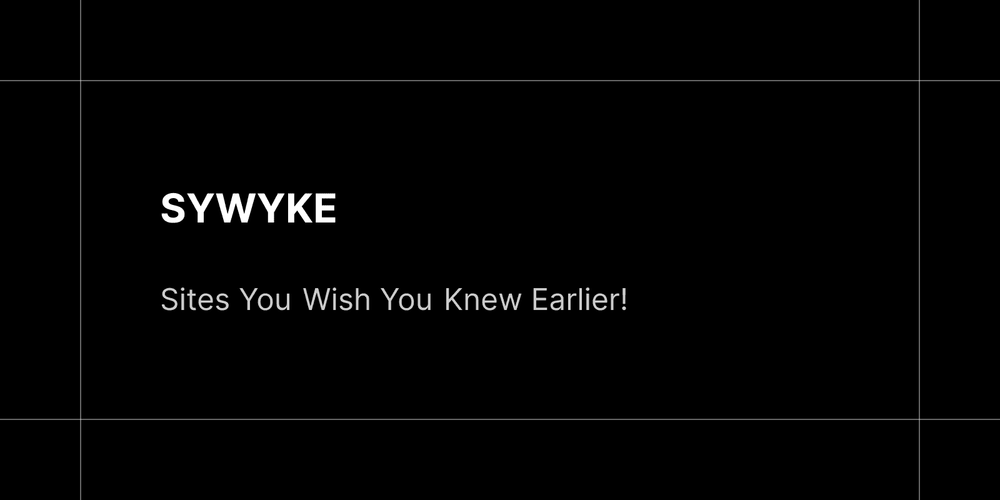

# SYWYKE

[](https://astro.build)



SYWYKE is an open-source project that aims to gather and showcase awesome websites on the internet. It provides a platform for users to discover and explore websites based on their interests and preferences.

## Features

- **Astro 7:** SYWYKE is built using Astro 7, a modern front-end framework for building websites. Astro combines the best of static site generation and server-side rendering to deliver fast, performant websites.

- **React 19 & Tailwind CSS 4:** Modern UI components built with React 19 and styled with the latest Tailwind CSS 4.

- **Minimalist Dashboard:** A streamlined, interactive dashboard experience for managing and discovering bookmarks.

- **Zustand 5:** Global state management for bookmarks, collections, and tags.

- **Pagefind Search:** Fast, client-side search functionality powered by Pagefind.

- **Tagging System:** Each website in SYWYKE is associated with one or more tags, allowing users to filter websites based on their interests.

- **Easy Contribution:** Adding a new website to SYWYKE is simple. Just add its details (ID, title, URL, description, and tags) to the centralized `src/lib/seed-data.json` file.

- **Responsive Design:** SYWYKE is designed to be responsive, ensuring that it looks great and functions well on different devices on screen sizes.

## Getting Started

To run SYWYKE locally, follow these steps:

1. Clone the repository: `git clone https://github.com/AREA44/SYWYKE.git`
2. Navigate to the project directory: `cd SYWYKE`
3. Install dependencies: `pnpm install`
4. Start the local development server: `pnpm run dev` (the SQLite database will automatically initialize and seed itself on first load!).
5. Open your browser and visit [http://localhost:4321](http://localhost:4321) to view the SYWYKE site.

## How to Add a New Site

Adding a new website to the SYWYKE collection is simple. Follow these steps:

1. **Locate the seed data file:**
   Open `src/lib/seed-data.json` in your editor.

2. **Add a new site entry:**
   Insert a new JSON object alphabetically into the list. For example:
   ```json
   {
     "id": "my-awesome-site",
     "title": "My Awesome Site",
     "url": "https://example.com",
     "description": "An amazing resource that you wish you knew earlier.",
     "tags": ["design", "tool"]
   }
   ```
   *Available Tags:* `"ai"`, `"design"`, `"develop"`, `"download"`, `"explore"`, `"language"`, `"learn"`, `"opensource"`, `"photo"`, `"share"`, `"tool"`, `"ui"`, `"video"`.

3. **Synchronize the database:**
   * **Automatic Synchronizing:** Restart your local dev server or trigger a build, and our automatic database initialization fallback will detect any changes and synchronize them seamlessly.
   * **Manual Seeding:** Alternatively, run `pnpm run db:seed` in your terminal to manually re-seed your local SQLite database from the JSON file.

## Contributing

If you would like to contribute to SYWYKE, feel free to follow these steps:

1. Fork the repository on GitHub.
2. Create a new branch for your feature or bug fix.
3. Make the necessary changes and commit your changes.
4. Push the branch to your forked repository.
5. Open a pull request on the main SYWYKE repository.

## License

SYWYKE is licensed under the MIT License.

## Credits

We build upon the knowledge and success of these pioneers. Here are a few Open Source projects that have inspired us along the way.

- [shadcn/ui](https://ui.shadcn.com)
- [Square UI](https://square.lndev.me)
